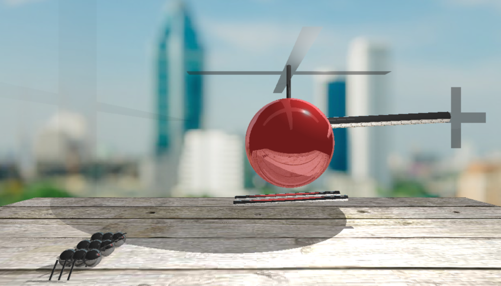

# Ray Tracer - Computer Graphics 2018

Final project for Computer Graphics Course 2018 - this implementation won the class vote for best project. It's implemented entirely in C.

The results aren't pretty and the code is messy but consider this was completed through all-nighters on a very low end laptop.

Results can be found 

